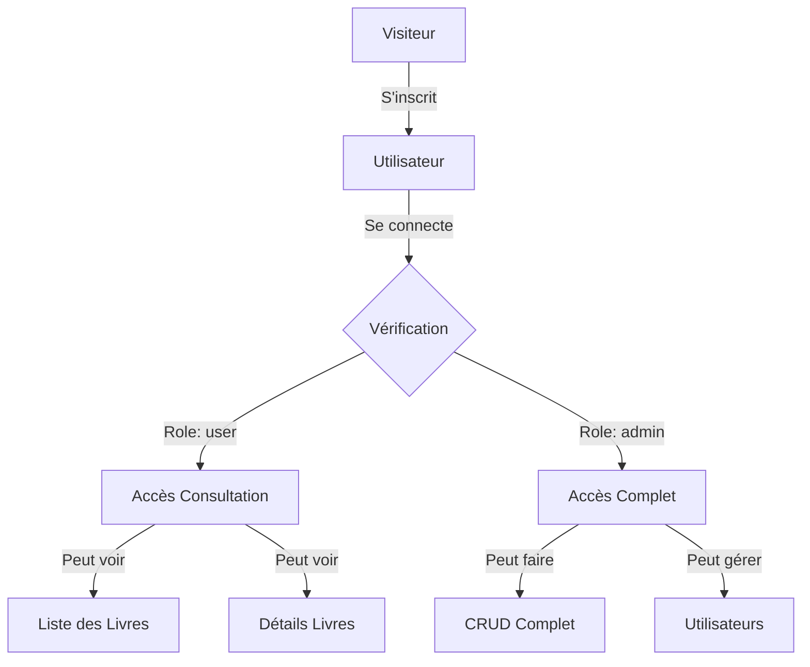

## 📖 À Propos du Projet

**Système de Gestion de Bibliothèque** est une application web moderne développée avec Laravel 11, offrant une solution complète pour gérer une collection de livres avec un système d'authentification sécurisé et une gestion des rôles utilisateurs.

### ✨ Points Forts

- 🔐 **Authentification Sécurisée** - Laravel Breeze intégré
- 👥 **Gestion des Rôles** - Admin et Utilisateurs
- 📚 **CRUD Complet** - Gestion complète des livres
- 🎨 **Interface Moderne** - Design responsive avec Tailwind CSS
- 🖼️ **Gestion d'Images** - Upload et gestion des couvertures
- 🔍 **Validation Avancée** - Form Requests personnalisés
- 📱 **Responsive Design** - Compatible mobile, tablette et desktop

---

## 🚀 Fonctionnalités

### 👤 Pour les Utilisateurs

```diff
+ ✅ Inscription et connexion sécurisées
+ ✅ Consultation de la liste des livres
+ ✅ Visualisation des détails d'un livre
+ ✅ Gestion du profil utilisateur
+ ✅ Recherche et filtrage des livres
```

### 👨‍💼 Pour les Administrateurs

```diff
+ ✅ Toutes les fonctionnalités utilisateur
+ ✅ Ajout de nouveaux livres
+ ✅ Modification des informations
+ ✅ Suppression de livres
+ ✅ Gestion des images de couverture
+ ✅ Tableau de bord d'administration
```

---

## 🛠️ Technologies Utilisées

<div align="center">

### Backend

| Technologie | Version | Description |
|------------|---------|-------------|
|  | 11.x | Framework PHP |
|  | 8.1+ | Langage serveur |
|  | 8.0 | Base de données |

### Frontend

| Technologie | Version | Description |
|------------|---------|-------------|
|  | 3.x | Framework CSS |
|  | - | Moteur de templates |
|  | 5.x | Build tool |

### Packages

| Package | Description |
|---------|-------------|
| **Laravel Breeze** | Authentification légère |
| **Form Requests** | Validation des données |
| **Eloquent ORM** | Gestion base de données |

</div>

---

## 📋 Prérequis

Avant de commencer, assurez-vous d'avoir installé :

-  PHP 8.1 ou supérieur
-  Composer
-  Node.js et NPM
-  MySQL ou MariaDB

---

## 💻 Installation

### 1️⃣ Cloner le Projet

```bash
# Cloner le repository
git clone https://github.com/votre-username/biblio-laravel.git

# Accéder au dossier
cd biblio-laravel
```

### 2️⃣ Installer les Dépendances

```bash
# Installer les dépendances PHP
composer install

# Installer les dépendances NPM
npm install
```

### 3️⃣ Configuration

```bash
# Copier le fichier d'environnement
cp .env.example .env

# Générer la clé d'application
php artisan key:generate
```

### 4️⃣ Base de Données

```env
# Modifier le fichier .env avec vos informations
DB_CONNECTION=mysql
DB_HOST=127.0.0.1
DB_PORT=3306
DB_DATABASE=biblio_db
DB_USERNAME=root
DB_PASSWORD=votre_mot_de_passe
```

```bash
# Créer la base de données
mysql -u root -p
CREATE DATABASE biblio_db;
exit;

# Exécuter les migrations
php artisan migrate

# (Optionnel) Créer un utilisateur admin
php artisan db:seed --class=AdminUserSeeder
```

### 5️⃣ Compilation des Assets

```bash
# Pour le développement
npm run dev

# Pour la production
npm run build
```

### 6️⃣ Lancer l'Application

```bash
# Lancer le serveur
php artisan serve

# L'application sera accessible sur : http://localhost:8000
```

---

## 👥 Comptes par Défaut

<div align="center">

### 🔑 Administrateur

| Champ | Valeur |
|-------|--------|
| **Email** | `admin@biblio.com` |
| **Mot de passe** | `password123` |
| **Rôle** | `admin` |

> ⚠️ **Important** : Changez ces identifiants en production !

</div>

---

## 📁 Structure du Projet

```
biblio-laravel/
├── 📂 app/
│   ├── 📂 Http/
│   │   ├── 📂 Controllers/
│   │   │   └── 📄 BookController.php
│   │   ├── 📂 Middleware/
│   │   │   └── 📄 IsAdmin.php
│   │   └── 📂 Requests/
│   │       ├── 📄 StoreBookRequest.php
│   │       └── 📄 UpdateBookRequest.php
│   └── 📂 Models/
│       ├── 📄 Book.php
│       └── 📄 User.php
├── 📂 database/
│   ├── 📂 migrations/
│   │   ├── 📄 create_books_table.php
│   │   └── 📄 add_role_to_users_table.php
│   └── 📂 seeders/
│       └── 📄 AdminUserSeeder.php
├── 📂 public/
│   └── 📂 covers/           # Images des livres
├── 📂 resources/
│   └── 📂 views/
│       ├── 📂 book/
│       │   ├── 📄 index.blade.php
│       │   ├── 📄 create.blade.php
│       │   ├── 📄 edit.blade.php
│       │   └── 📄 show.blade.php
│       └── 📂 layouts/
│           └── 📄 app.blade.php
└── 📂 routes/
    └── 📄 web.php
```

---

## 🔐 Système d'Authentification

### Architecture de Sécurité



### Middleware de Protection

| Middleware | Route | Description |
|-----------|-------|-------------|
| `guest` | `/login`, `/register` | Accessible aux visiteurs |
| `auth` | `/profile`, `/books` | Nécessite connexion |
| `auth` + `admin` | `/book/create`, `/book/{id}/edit` | Réservé aux admins |

---


## 🔧 Utilisation

### 📖 Gestion des Livres

#### Ajouter un Livre (Admin)

```bash
1. Se connecter en tant qu'admin
2. Naviguer vers "Livres" → "Ajouter un livre"
3. Remplir le formulaire :
   - Désignation (obligatoire)
   - Auteur (obligatoire)
   - Date de publication (obligatoire)
   - Nombre de pages (obligatoire, minimum 1)
   - Couverture (image, optionnel)
4. Soumettre le formulaire
```

#### Modifier un Livre (Admin)

```bash
1. Dans la liste des livres, cliquer sur "Modifier"
2. Modifier les informations souhaitées
3. Option : Supprimer la couverture actuelle
4. Option : Uploader une nouvelle couverture
5. Enregistrer les modifications
```

#### Consulter un Livre (Tous)

```bash
1. Naviguer vers la liste des livres
2. Cliquer sur un livre pour voir les détails
3. Voir toutes les informations (titre, auteur, pages, etc.)
```

---

## 🧪 Tests

### Tester l'Application

```bash
# Lancer les tests unitaires
php artisan test

# Tester un utilisateur normal
1. S'inscrire avec un compte normal
2. Vérifier : pas d'accès aux boutons CRUD
3. Vérifier : erreur 403 sur /book/create

# Tester un admin
1. Se connecter avec admin@biblio.com
2. Vérifier : accès à tous les boutons CRUD
3. Tester : création, modification, suppression
```

---

## 🛡️ Sécurité

### Mesures Implémentées

- ✅ **Authentification** - Laravel Breeze avec hash bcrypt
- ✅ **CSRF Protection** - Tokens sur tous les formulaires
- ✅ **Validation** - Form Requests avec règles strictes
- ✅ **Middleware** - Protection des routes sensibles
- ✅ **Upload Sécurisé** - Validation des images
- ✅ **SQL Injection** - Eloquent ORM et requêtes préparées
- ✅ **XSS Protection** - Échappement automatique Blade

### Bonnes Pratiques

```bash
# Ne JAMAIS commiter le fichier .env
# Changer les identifiants par défaut en production
# Utiliser HTTPS en production
# Activer les logs d'erreurs
```

---

## 🚀 Déploiement

### Déploiement en Production

```bash
# 1. Optimiser l'application
php artisan config:cache
php artisan route:cache
php artisan view:cache

# 2. Compiler les assets pour la production
npm run build

# 3. Configurer les permissions
chmod -R 775 storage bootstrap/cache
chown -R www-data:www-data storage bootstrap/cache

# 4. Configurer .env pour la production
APP_ENV=production
APP_DEBUG=false
```

---

## 📊 Fonctionnalités Détaillées

### 🔹 Gestion des Livres

| Fonctionnalité | User | Admin | Description |
|----------------|------|-------|-------------|
| Voir la liste | ✅ | ✅ | Pagination 15 livres/page |
| Voir détails | ✅ | ✅ | Informations complètes |
| Ajouter livre | ❌ | ✅ | Upload couverture possible |
| Modifier livre | ❌ | ✅ | Modifier tous les champs |
| Supprimer livre | ❌ | ✅ | Suppression avec confirmation |
| Upload image | ❌ | ✅ | Format: jpg, png (max 2MB) |

### 🔹 Authentification

- ✅ Inscription avec validation email unique
- ✅ Connexion sécurisée
- ✅ Déconnexion
- ✅ Réinitialisation mot de passe
- ✅ Vérification email (optionnel)
- ✅ Remember me

---

## 🤝 Contribution

Les contributions sont les bienvenues ! Pour contribuer :

1. 🍴 Fork le projet
2. 🌿 Créer une branche (`git checkout -b feature/AmazingFeature`)
3. 💾 Commit les changements (`git commit -m 'Add AmazingFeature'`)
4. 📤 Push vers la branche (`git push origin feature/AmazingFeature`)
5. 🔃 Ouvrir une Pull Request

---

## 📝 Roadmap

### Version 1.0 (Actuelle) ✅

- [x] Authentification avec Breeze
- [x] CRUD Livres
- [x] Système de rôles
- [x] Upload d'images

### Version 2.0 (Prochaine) 🚧

- [ ] Système de catégories
- [ ] Recherche avancée
- [ ] Emprunt de livres
- [ ] Gestion des stocks
- [ ] Notifications email
- [ ] Tableau de bord statistiques
- [ ] Export PDF/Excel
- [ ] API REST

### Version 3.0 (Future) 💡

- [ ] Application mobile
- [ ] Scanner code-barres
- [ ] Système de réservation
- [ ] Multi-bibliothèques
- [ ] Dark mode
- [ ] PWA

---

## 🐛 Bugs Connus

Aucun bug majeur connu actuellement. Si vous en trouvez, merci de créer une [issue](https://github.com/votre-username/biblio-laravel/issues).

---

## ❓ FAQ

<details>
<summary><b>Comment créer un nouvel administrateur ?</b></summary>

```bash
php artisan tinker
\App\Models\User::create([
    'name' => 'Nom Admin',
    'email' => 'admin@exemple.com',
    'password' => bcrypt('motdepasse'),
    'role' => 'admin'
]);
```
</details>

<details>
<summary><b>Comment changer le rôle d'un utilisateur existant ?</b></summary>

```bash
php artisan tinker
$user = \App\Models\User::where('email', 'user@exemple.com')->first();
$user->role = 'admin';
$user->save();
```
</details>

<details>
<summary><b>Erreur "npm run dev" ne fonctionne pas ?</b></summary>

```bash
rm -rf node_modules package-lock.json
npm install
npm run dev
```
</details>

<details>
<summary><b>Les images ne s'affichent pas ?</b></summary>

Vérifiez que le dossier `public/covers` existe et a les bonnes permissions :

```bash
mkdir -p public/covers
chmod 775 public/covers
```
</details>

---

## 📄 License

Ce projet est sous licence MIT. Voir le fichier [LICENSE](LICENSE) pour plus de détails.

---

## 👨‍💻 Auteur

<div align="center">

**Votre Nom**

[](https://github.com/votre-username)
[](https://linkedin.com/in/votre-profil)
[](mailto:votre@email.com)

</div>

---

## 🙏 Remerciements

- [Laravel](https://laravel.com/) - Le framework PHP
- [Tailwind CSS](https://tailwindcss.com/) - Le framework CSS
- [Laravel Breeze](https://github.com/laravel/breeze) - Kit d'authentification
- [Shields.io](https://shields.io/) - Pour les badges
- Communauté Laravel France

---

<div align="center">

### ⭐ Si ce projet vous a aidé, n'oubliez pas de lui donner une étoile ! ⭐

**Fait avec ❤️ et Laravel**


</div>